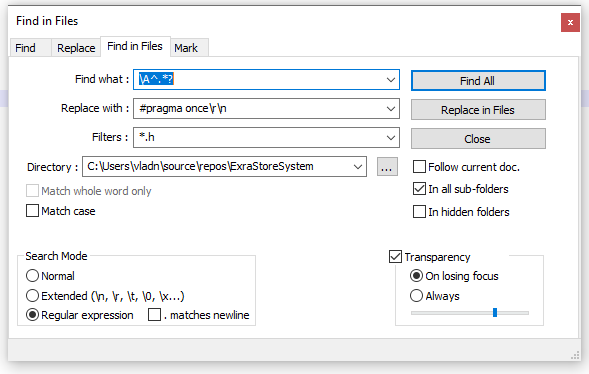

# CPP-automatic-update-options
Automatic update source files 

"#pragma once" is a non-standard but widely supported preprocessor directive designed to cause the current source file to be included only once in a single compilation.

Using "#pragma once" allows the C preprocessor to include a header file when it is needed and to ignore an #include directive otherwise. 

Some projects do not use this directive and this is not correct.

Adding #pragma once of multiple headers cpp files in Notepad++ 

