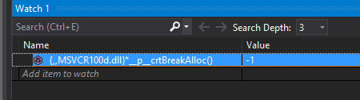

# CPP-automatic-update-options / Debug a memory allocation

## Inserting "#pragma once" preprocessor directive in the multiple files

"#pragma once" is a non-standard but widely supported preprocessor directive designed to cause the current source file to be included only once in a single compilation.

Using "#pragma once" allows the C preprocessor to include a header file when it is needed and to ignore an #include directive otherwise. 

Some projects do not use this directive and this is not correct.

Adding #pragma once of multiple headers *.h files with Notepad++ 

		Find :  \A^.*?
		Replace with : #pragma once\n\r
		Files: *.h
		Search Mode: Regular Expression

## Find memory leaks in multiple CPP files

### Enable memory leak detection 

The preceding techniques identify memory leaks for memory allocated using the standard CRT malloc function. If your program allocates memory using the C++ new operator, however, you may only see the filename and line number where operator new calls _malloc_dbg in the memory-leak report.

Inserting redifinition into *.cpp files

		Find :  \A^.*?
		Replace with : #ifdef _DEBUG\n\r#define new DBG_NEW\n\r#endif\n\r
		Files: *.cpp
		Search Mode: Regular Expression

		
Inserting redifinition for all *.cpp files

		Find :  \A^.*?
		Replace with : #ifdef _DEBUG\n\r#define DBG_NEW new ( _NORMAL_BLOCK , __FILE__ , __LINE__ )\n\r#else\n\r#define DBG_NEW new\n\r#endif\n\r
		Files: *.cpp
		Search Mode: Regular Expression

and then:

To enable all the debug heap functions, include the following statements in your C++ program

		#define _CRTDBG_MAP_ALLOC
		#include <stdlib.h>
		#include <crtdbg.h>

Adding heap malloc detection function of multiple *.cpp files with Notepad++ 

		Find :  \A^.*?
		Replace with : #define _CRTDBG_MAP_ALLOC\n\r#include <stdlib.h>\n\r#include <crtdbg.h>\n\r
		Files: *.cpp
		Search Mode: Regular Expression 

By results you see in all cpp files

		#define _CRTDBG_MAP_ALLOC
		#include <cstdlib>
		#include <crtdbg.h>

		#ifdef _DEBUG
			#define DBG_NEW new ( _NORMAL_BLOCK , __FILE__ , __LINE__ )
			// Replace _NORMAL_BLOCK with _CLIENT_BLOCK if you want the
			// allocations to be of _CLIENT_BLOCK type
		#else
			#define DBG_NEW new
		#endif

		#ifdef _DEBUG
			#define new DBG_NEW
		#endif

By manual setting

		#ifdef _DEBUG
		#undef DEBUG_NEW
		#define DEBUG_NEW new(__FILE__, __LINE__)
		#define _CRTDBG_MAP_ALLOC
		#define new DEBUG_NEW
		#undef THIS_FILE
		static char BASED_CODE THIS_FILE[] = __FILE__;
		#else
		#undef _CRTDBG_MAP_ALLOC
		#define DEBUG_NEW new
		#endif

When you run this code in the Visual Studio debugger, the call to _CrtDumpMemoryLeaks generates a report in the Output window.		

For example :

				BOOL APIENTRY DllMain( HMODULE hModule,
									   DWORD  ul_reason_for_call,
									   LPVOID lpReserved
									 )
				{
					switch (ul_reason_for_call)
					{
					case DLL_PROCESS_ATTACH:
					case DLL_THREAD_ATTACH:
					case DLL_THREAD_DETACH:
					case DLL_PROCESS_DETACH:
					#ifdef _DEBUG					
					   _CrtDumpMemoryLeaks();
					#endif					   
						break;
					}
					return TRUE;
				}

## Brakpoint on memory leak detection items

1) Look memory leak report:

2) Start your debugging session:

3) Type _crtBreakAlloc in the Watch window. 
{,,MSVCR100d.dll}*__p__crtBreakAlloc()

{,,MSVCR100d.dll}*__p__crtBreakAlloc()

4) Double click on the -1 value, and enter the new allocation number that causes a user-defined breakpoint. After insert you see -1 ( current position )

5) From the Debug menu, choose Debug -> Go.
